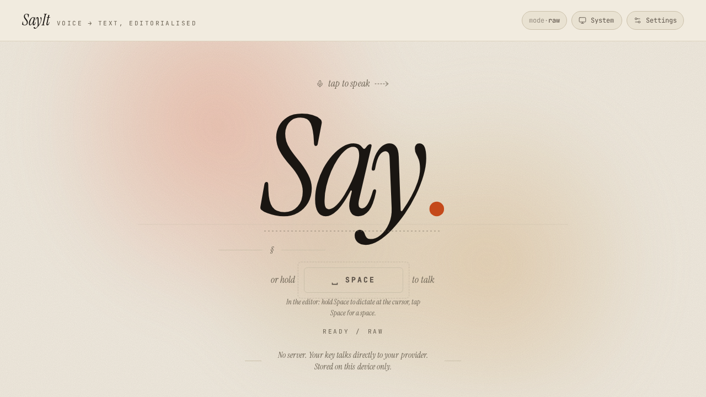
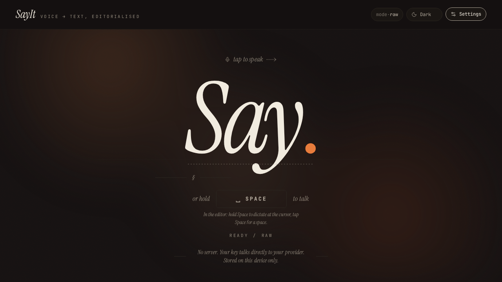
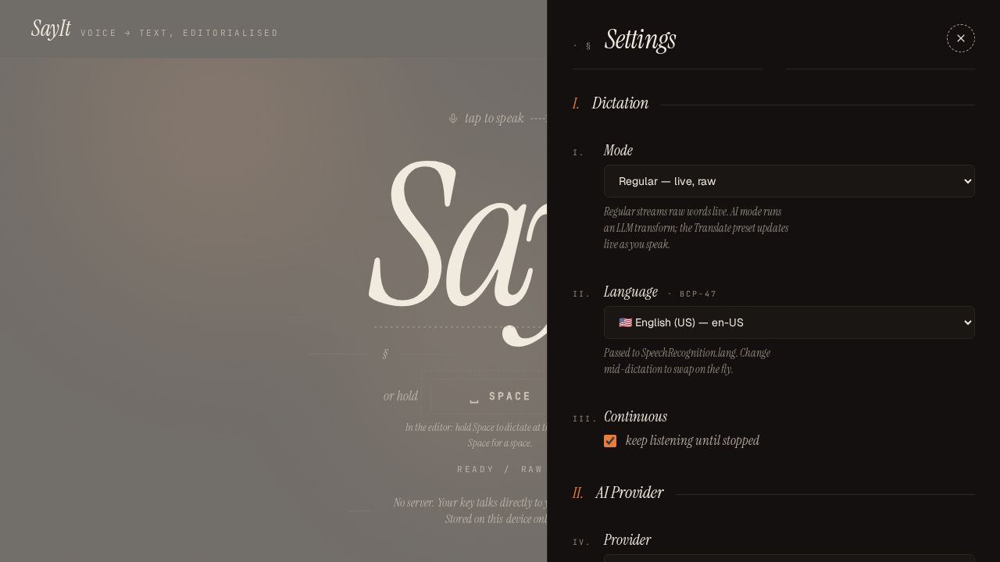

# SayIt

Voice dictation that feels editorial. Hold `Space`, speak, get polished text.

**Live:** [sayit-dictation.netlify.app](https://sayit-dictation.netlify.app)

Web Speech API for live transcription (Chrome / Edge / Brave), bring your own key for AI polish via Anthropic, OpenAI, Gemini, or any OpenAI-compatible endpoint (Groq, Together, Ollama).



<table>
  <tr>
    <td width="50%"></td>
    <td width="50%"></td>
  </tr>
  <tr>
    <td align="center"><sub>Dark theme — same wordmark, quieter ambient.</sub></td>
    <td align="center"><sub>Settings drawer — mode, language, provider.</sub></td>
  </tr>
</table>

## Features

- **Hold-Space to talk** or click the big italic *Say.* wordmark.
- **Live audio-reactive bars** in the Space keycap (driven by `AudioContext`, 60fps — independent of transcription latency).
- **Inline interim ghost text** flows right after committed words. No separate "live" box.
- **Imperative DOM hot path** — interim/final events bypass React state entirely. 0.002 ms per interim update.
- **8 AI presets** — Polish, Professional, Casual, Bullets, Summarize, Email, Translate, Custom.
- **Inline language switcher** in the transcript header. Change mid-dictation.
- **110+ languages** via BCP-47 tags passed to the Web Speech API.
- **Theme toggle** — system / dark / light.
- **Auto-save** transcript + settings to `localStorage`.
- **Firefox-aware** — shows a clear "this browser isn't supported" banner with a Copy-link action.

## Stack

- React 19, TypeScript, Vite 8 (Bun runtime)
- Tailwind v4 via `@tailwindcss/vite`
- Motion for animations, `react-hotkeys-hook` for keyboard handling
- Zero backend — API keys are sent direct browser → provider

## Develop

```bash
bun install
bun run dev       # http://localhost:5173
bun run build     # -> dist/
```

Requires a Chromium browser for dictation. Firefox can view the app but can't transcribe.

## Deploy

Built for Netlify. `netlify.toml` wires the headers (mic permission, SPA fallback) and the `bun run build` command.

## License

MIT
